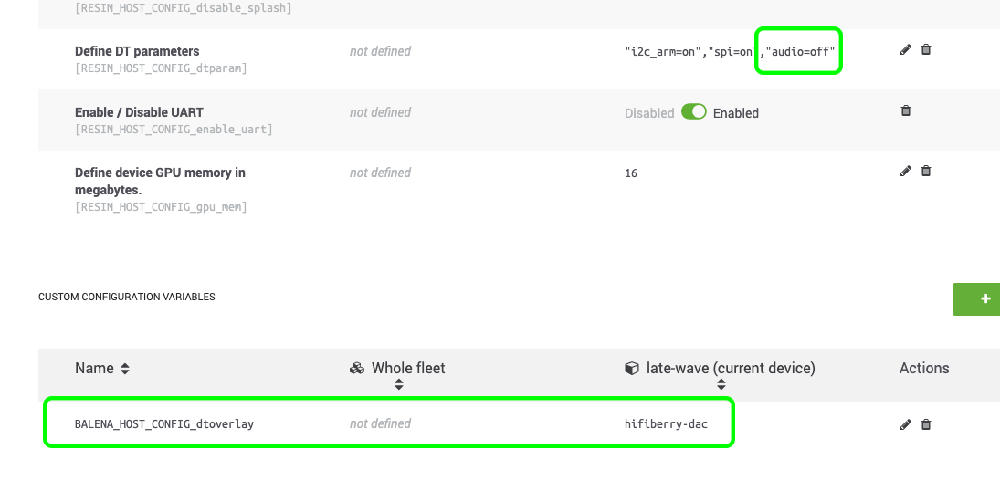

# Bluetooth, Airplay and Spotify audio streaming for any audio device

**Starter project enabling you to add multi-room audio streaming via Bluetooth, Airplay or Spotify Connect to any old speakers or Hi-Fi using just a Raspberry Pi.**

**Features**
- **Bluetooth, Airplay and Spotify Connect support**: Stream audio from your favourite music services or directly from your smartphone/computer using bluetooth.
- **Multi-room synchronous playing**: Play perfectly synchronized audio on multiple devices all over your place.

### Hardware required

* Raspberry Pi 3A+/3B/3B+/4B/Zero W
* SD Card (we recommend 8GB Sandisk Extreme Pro)
* Power supply
* 3.5mm audio cable to the input on your speakers/Hi-Fi (usually 3.5mm or RCA). Alternatively you can use the HDMI port to get digital audio out.

**Notes** 
- The Raspberry Pi Zero cannot be used on it's own as it has no audio output. To use the Pi Zero you'll need to add something like the [Pimoroni pHAT DAC](https://shop.pimoroni.com/products/phat-dac) (out of stock and going to be replaced, see [#111](https://github.com/balenalabs/balena-sound/issues/111)) to go with it.
- For an extended list of device types supported please check this [link](DeviceSupport.md).

### Software required

* A download of this project (of course)
* Software to flash an SD card ([balenaEtcher](https://balena.io/etcher))
* A free [balenaCloud](https://balena.io/cloud) account
* The [balena CLI tools](https://github.com/balena-io/balena-cli/blob/master/INSTALL.md)

# Setup and use

Running this project is as simple as deploying it to a balenaCloud application; no additional configuration is required (unless you're using a DAC HAT). All the setup steps below are done from your MacOS, Windows or Linux computer, not the Raspberry Pi.

One-click deploy to balenaCloud:

**or**

### Setup the Raspberry Pi

* Sign up for or login to the [balenaCloud dashboard](https://dashboard.balena-cloud.com)
* Create an application, selecting the correct device type for your Raspberry Pi (we recommend setting the type as Raspberry Pi 1/Zero as your application will then be compatible with the Pi 1/Zero as well as all devices that were released afterward).
* Add a device to the application, enabling you to download the OS
* Flash the downloaded OS to your SD card with [balenaEtcher](https://balena.io/etcher)
* Power up the Pi and check it's online in the dashboard

### Deploy this application

* Install the [balena CLI tools](https://github.com/balena-io/balena-cli/blob/master/INSTALL.md)
* Login with `balena login`
* Download this project and from the project directory run `balena push <appName>` where `<appName>` is the name you gave your balenaCloud application in the first step.

# Usage

After the application has pushed and the device has downloaded the latest changes you're ready to go! Before starting, connect the audio output of your Pi to the AUX input on your Hi-Fi or speakers. You can also use the HDMI port for digital audio output.

Connect to your balenaSound device:
* If using Bluetooth: search for your device on your phone or laptop and pair.
* If using Airplay: select the balenaSound device from your audio output options.
* If using Spotify Connect: open Spotify and choose the balenaSound device as an alternate output.
* The `balenaSound xxxx` name is used by default, where `xxxx` will be the first 4 characters of the device ID in the balenaCloud dashboard.

If you are running in multi-room mode, when you start streaming the device you're connected to will configure itself as the `master` and will broadcast a message to all other devices within your balenaCloud application to get them in sync. **Note:** that it can take a few seconds for the system to autoconfigure the first time you stream.

Let the music play!

# Customize your balenaSound experience

You can configure some features of balenaSound by using environment variables. This can be set in the balena dashboard: navigate to dashboard -> your app -> Environment variables. Read more about environment variables [here](https://www.balena.io/docs/learn/manage/serv-vars/#fleet-environment-and-service-variables).

### Change device name

By default, your device will be named `balenaSound xxxx`. This name will show within Airplay device lists, for Spotify Connect and when searching for devices using Bluetooth.
You can change this using `DEVICE_NAME` environment variable that can be set in balena dashboard.

### Set output volumes

By default, balenaSound will set the output volume of your Raspberry Pi to 75% on the basis you can then control the volume upto the maximum from the connected bluetooth device. If you would like to override this, define the `SYSTEM_OUTPUT_VOLUME` environment variable.

Secondly, balenaSound will play connection/disconnection notification sounds at a volume of 75%. If this unsuitable, you can override this with the `CONNECTION_NOTIFY_VOLUME` environment variable.

**Note:** these variables should be defined as integer values without the `%` symbol.

### Multi-room

By default, balenaSound will start in multi-room mode. When running multi-room you can stream audio into a fleet of devices and have it play perfectly synchronized. It does not matter wether you have 2 or 100 devices, you only need them to be part of the same local network.

If you don't want to use multi-room or you only have one device, you can disable it by creating the `DISABLE_MULTI_ROOM` variable (with any value, for example: `1`).

**Note:** Multi-room requires a network router that supports IP multicast/broadcast (most modern routers do).

### Client Only Multi-room

By default, balenaSound lets you connect and stream audio from every device on the fleet. If you prefer to have one or more devices "hidden" in the network but still capable of playing multi-room audio you can set the device to Client Only mode.

Client Only mode only runs the services needed to synchronize and play the audio that is being streamed from the multi-room master server; all other services will be disabled. This makes for less clutter in the devices overview when connecting from Spotify, Airplay or Bluetooth and lowers the load on the devices running Client Only mode.

If you want to set a device in Client Only mode, create a `CLIENT_ONLY_MULTI_ROOM` variable with value `1`.

**Note**: Client Only mode only works if multi-room mode is enabled. When you disable multi-room mode, the `CLIENT_ONLY_MULTI_ROOM` variable is ignored to prevent all services being down.

### Set bluetooth PIN code

By default, balenaSound bluetooth will connect using Secure Simple Pairing mode. If you would like to override this and use Legacy Mode with a PIN code you can do it by defining the `BLUETOOTH_PIN_CODE` environment variable. The PIN code must be numeric and up to six digits (1 - 999999).

**Note**: Legacy Mode is no longer allowed on [iOS](https://developer.apple.com/accessories/Accessory-Design-Guidelines.pdf) devices.

### Bluetooth scripts

balenaSound has configurable scripts you can run on connect and disconnect bluetooth events. If you would like to activate this, set the  `BLUETOOTH_SCRIPTS` environment variable to `true`.
Sample scripts can be found on the `./bluetooth-audio/bluetooh-scripts/` directory, theses can be edited as needed.

### Spotify Connect over the internet

Spotify Connect only works with Spotify Premium accounts (due to the use of the [librespot](https://github.com/librespot-org/librespot) library).

### DAC Configuration

If you are using a DAC board, you will need to make a couple of changes to the device configuration in the balenaCloud dashboard.

* Disable the on-board audio by editing the existing `RESIN_HOST_CONFIG_dtparam` variable to set `”audio=off”`.
* Add an additional custom configuration variable called `BALENA_HOST_CONFIG_dtoverlay`. The value of this will depend on your DAC board. A table of values is available [here](DAC_configuration.md)

## Connect

* After the application has pushed and the device has downloaded the latest changes you're ready to go!
* Connect the audio output of your Pi to the AUX input on your Hi-Fi or speakers
* The `balenaSound bluetooth/airplay/spotify xxxx` name is used by default, where `xxxx` will be the first 4 characters of the device ID in the balenaCloud dashboard.
* If using Bluetooth: search for your device on your phone or laptop and pair.
* If using Airplay: select the balenaSound device from your audio output options.
* If using Spotify Connect: open Spotify and choose the balenaSound device as an alternate output.
* Let the music play!
If you have a Spotify Premium account you can stream locally without any configuration, but if you want to use Spotify Connect over the internet you will need to provide your Spotify credentials.

To enable Spotify login you can add your username/e-mail and password, which are set with two environment variables: `SPOTIFY_LOGIN` and `SPOTIFY_PASSWORD`.  

## Acknowledgements

This project is made possible by the awesome work of various open source projects, including [Shairport Sync](https://github.com/mikebrady/shairport-sync), [Raspotify](https://github.com/dtcooper/raspotify) and [Snapcast](https://github.com/badaix/snapcast).

---

This project is in active development so if you have any feature requests or issues please submit them here on GitHub. PRs are welcome, too.
