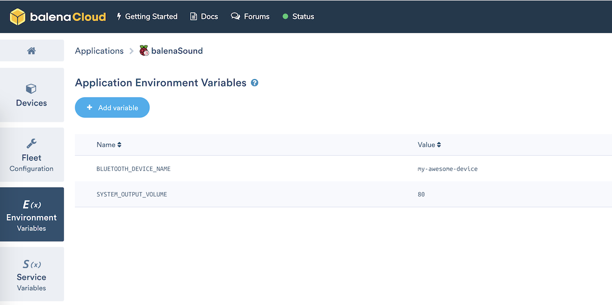

# Bluetooth, Airplay and Spotify audio streaming for any audio device

**Starter project enabling you to add audio streaming via Bluetooth, Airplay or Spotify Connect to any old speakers or Hi-Fi using just a Raspberry Pi.**

This project has been tested on Raspberry Pi 3B/3B+ and Raspberry Pi Zero W. If you're using a Raspberry Pi 3 or above you don't need any additional hardware but if you'd like to use a Pi Zero W this will require an additional HAT as this model has no audio output.

## Hardware required

* Raspberry Pi 3A+/3B/3B+/Zero W
* SD Card (we recommend 8GB Sandisk Extreme Pro)
* Power supply
* 3.5mm audio cable to the input on your speakers/Hi-Fi (usually 3.5mm or RCA)

**Note:** the Raspberry Pi Zero cannot be used on it's own as it has no audio output. To use the Pi Zero you'll need to add something like the [Pimoroni pHAT DAC](https://shop.pimoroni.com/products/phat-dac) to go with it.

## Software required

* A download of this project (of course)
* Software to flash an SD card ([balenaEtcher](https://balena.io/etcher))
* A free [balenaCloud](https://balena.io/cloud) account
* The [balena CLI tools](https://github.com/balena-io/balena-cli/blob/master/INSTALL.md)

## Setup and use

To run this project is as simple as deploying it to a balenaCloud application; no additional configuration is required (unless you're using a DAC HAT).

### Setup the Raspberry Pi

* Sign up for or login to the [balenaCloud dashboard](https://dashboard.balena-cloud.com)
* Create an application, selecting the correct device type for your Raspberry Pi
* Add a device to the application, enabling you to download the OS
* Flash the downloaded OS to your SD card with [balenaEtcher](https://balena.io/etcher)
* Power up the Pi and check it's online in the dashboard

### Deploy this application

* Install the [balena CLI tools](https://github.com/balena-io/balena-cli/blob/master/INSTALL.md)
* Login with `balena login`
* Download this project and from the project directory run `balena push <appName>` where `<appName>` is the name you gave your balenaCloud application in the first step.

### Customize device name

By default, your device will be named `balenaSound xxxx`. This name will show within Airplay device lists, for Spotify Connect and when searching for devices using Bluetooth.
You can change this using `BLUETOOTH_DEVICE_NAME` environment variable that can be set in balena dashboard
(navigate to dashboard -> app -> device -> device variables). This environment variable sets the name for all 3 services.

### Set output volumes

By default, balenaSound will set the output volume of your Raspberry Pi to 100% on the basis you can then control the volume upto the maximum from the connected bluetooth device. If you would like to override this, define the `SYSTEM_OUTPUT_VOLUME` environment variable.

Secondly, balenaSound will play connection/disconnection notification sounds at a volume of 75%. If this unsuitable, you can override this with the `CONNECTION_NOTIFY_VOLUME` environment variable.

**Note:** these variables should be defined as integer values without the `%` symbol.

### Set bluetooth PIN code (optional)

By default, balenaSound bluetooth will connect using Secure Simple Pairing mode. If you would like to override this and use Legacy Mode with a PIN code you can do it by defining the `BLUETOOTH_PIN_CODE` environment variable. The PIN code must be numeric and up to six digits (1 - 999999).

**Note**: Legacy Mode is no longer allowed on [iOS](https://developer.apple.com/accessories/Accessory-Design-Guidelines.pdf) devices.

### Bluetooth Scripts (optional)

balenaSound has configurable scripts you can run on connect and disconnect bluetooth events. If you would like to activate this, set the  `BLUETOOTH_SCRIPTS` environment variable to `true`.
Sample scripts can be found on the `./bluetooth-audio/bluetooh-scripts/` directory, theses can be edited as needed.

### Spotify login (optional)

balenaSound Spotify Connect works with only Spotify Premium accounts (due to the use of the [librespot](https://github.com/librespot-org/librespot) library).
To enable Spotify login you can add your username/e-mail and password, which are set with two environment variables: `SPOTIFY_LOGIN` and `SPOTIFY_PASSWORD`.  **Note:** this is only required if you want to use Spotify Connect via the internet, the login is not required on local networks.

## Connect

* After the application has pushed and the device has downloaded the latest changes you're ready to go!
* Connect the audio output of your Pi to the AUX input on your Hi-Fi or speakers
* The `balenaSound xxxx` name is used by default, where `xxxx` will be the first 4 characters of the device ID in the balenaCloud dashboard.
* If using Bluetooth: search for your device on your phone or laptop and pair.
* If using Airplay: select the balenaSound device from your audio output options.
* If using Spotify Connect: open Spotify and choose the balenaSound device as an alternate output.
* Let the music play!

This project is in active development so if you have any feature requests or issues please submit them here on GitHub. PRs are welcome, too.
