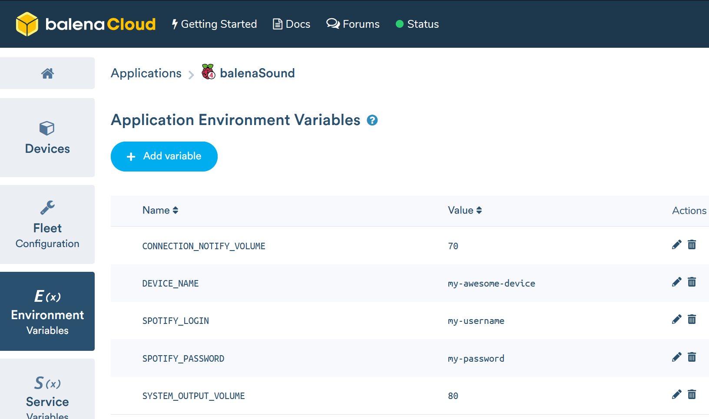

# Bluetooth audio streaming for any audio device

**Starter project enabling you to add bluetooth audio streaming to any old speakers or Hi-Fi using just a Raspberry Pi.**

This project has been tested on Raspberry Pi 3B/3B+ and Raspberry Pi Zero W. If you're using a Raspberry Pi 3 or above you don't need any additional hardware but if you'd like to use a Pi Zero W this will require an additional HAT as this model has no audio output.

## Hardware required

* Raspberry Pi 3A+/3B/3B+/Zero W
* SD Card (we recommend 8GB Sandisk Extreme Pro)
* Power supply
* 3.5mm audio cable to the input on your speakers/Hi-Fi (usually 3.5mm or RCA)

**Note:** the Raspberry Pi Zero cannot be used on it's own as it has no audio output. To use the Pi Zero you'll need to add something like the [Pimoroni pHAT DAC](https://shop.pimoroni.com/products/phat-dac) to go with it.

## Software required

* A download of this project (of course)
* Software to flash an SD card ([balenaEtcher](https://balena.io/etcher))
* A free [balenaCloud](https://balena.io/cloud) account
* The [balena CLI tools](https://github.com/balena-io/balena-cli/blob/master/INSTALL.md)

## Setup and use

To run this project is as simple as deploying it to a balenaCloud application; no additional configuration is required (unless you're using a DAC HAT).

### Setup the Raspberry Pi

* Sign up for or login to the [balenaCloud dashboard](https://dashboard.balena-cloud.com)
* Create an application, selecting the correct device type for your Raspberry Pi
* Add a device to the application, enabling you to download the OS
* Flash the downloaded OS to your SD card with [balenaEtcher](https://balena.io/etcher)
* Power up the Pi and check it's online in the dashboard

### Customize device name

By default, your device will be displayed as `balenaSound xxxx` when you search for Bluetooth devices.
You can change this using `BLUETOOTH_DEVICE_NAME` environment variable that can be set in balena dashboard
(navigate to dashboard -> app -> device -> device variables).



### Deploy this application

* Install the [balena CLI tools](https://github.com/balena-io/balena-cli/blob/master/INSTALL.md)
* Login with `balena login`
* Download this project and from the project directory run `balena push <appName>` where `<appName>` is the name you gave your balenaCloud application in the first step.

### Connect

* After the application has pushed and the device has downloaded the latest changes you're ready to go!
* Connect the audio output of your Pi to the AUX input on your Hi-Fi or speakers
* Search for your device (`balenaSound xxxx` name is used by default) on your phone or laptop and pair. `xxxx` will be the first 4 characters of the device ID in the balenaCloud dashboard.
* Let the music play!

This project is in active development so if you have any feature requests or issues please submit them here on GitHub. PRs are welcome, too.

### Multiple container use
If you plan to use Balena Sound as part of a multiple container app (for example, having an app with PiHole & Balena sound), don't forget to add the following label to your `docker-compose.yml` file. (source: https://www.balena.io/docs/learn/develop/multicontainer/#labels)

Example:
```
bluetooth:
  build: ./bluetooth-audio
  privileged: true
  network_mode: host
  labels:
    io.balena.features.dbus: '1'
```
