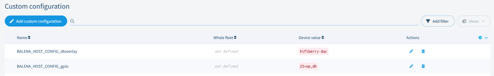

# Customize your balenaSound experience

You can configure some features of balenaSound by using environment variables. This can be set in the balena dashboard: navigate to dashboard -> your app -> Environment variables. Read more about environment variables [here](https://www.balena.io/docs/learn/manage/serv-vars/#fleet-environment-and-service-variables).

## Change device name

By default, your device will be named `balenaSound xxxx`. This name will show within Airplay device lists, for Spotify Connect and when searching for devices using Bluetooth.
You can change this using `BLUETOOTH_DEVICE_NAME` environment variable that can be set in balena dashboard.

## Set output volumes

By default, balenaSound will set the output volume of your Raspberry Pi to 75% on the basis you can then control the volume upto the maximum from the connected bluetooth device. If you would like to override this, define the `SYSTEM_OUTPUT_VOLUME` environment variable.

Secondly, balenaSound will play connection/disconnection notification sounds at a volume of 75%. If this unsuitable, you can override this with the `CONNECTION_NOTIFY_VOLUME` environment variable.

**Note:** these variables should be defined as integer values without the `%` symbol.

## Multi-room

By default, balenaSound will start in multi-room mode. When running multi-room you can stream audio into a fleet of devices and have it play perfectly synchronized. It does not matter wether you have 2 or 100 devices, you only need them to be part of the same local network.

If you don't want to use multi-room or you only have one device, you can disable it by creating the `DISABLE_MULTI_ROOM` variable (with any value, for example: `1`).

**Note:** Multi-room requires a network router that supports IP multicast/broadcast (most modern routers do).

## Set bluetooth PIN code

By default, balenaSound bluetooth will connect using Secure Simple Pairing mode. If you would like to override this and use Legacy Mode with a PIN code you can do it by defining the `BLUETOOTH_PIN_CODE` environment variable. The PIN code must be numeric and up to six digits (1 - 999999).

**Note**: Legacy Mode is no longer allowed on [iOS](https://developer.apple.com/accessories/Accessory-Design-Guidelines.pdf) devices.

## Bluetooth scripts

balenaSound has configurable scripts you can run on connect and disconnect bluetooth events. If you would like to activate this, set the  `BLUETOOTH_SCRIPTS` environment variable to `true`.
Sample scripts can be found on the `./bluetooth-audio/bluetooh-scripts/` directory, theses can be edited as needed.

## Spotify Connect over the internet

Spotify Connect only works with Spotify Premium accounts (due to the use of the [librespot](https://github.com/librespot-org/librespot) library).

## DAC Configuration

If you are using a DAC board, you will need to make a couple of changes to the device configuration in the balenaCloud dashboard.

* Disable the on-board audio by editing the existing `RESIN_HOST_CONFIG_dtparam` variable to set `”audio=off”`.
* Add an additional custom configuration variable called `BALENA_HOST_CONFIG_dtoverlay`. The value of this will depend on your DAC board. A table of values is available [here](DAC_configuration.md)

